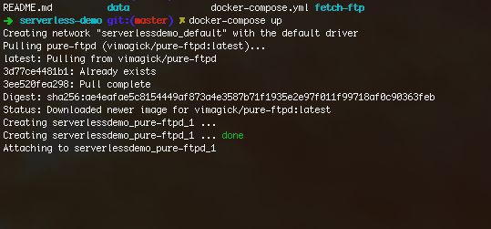
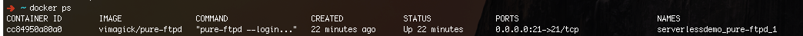
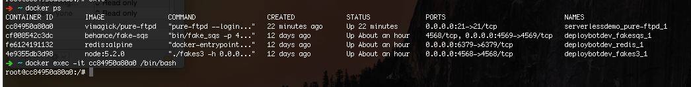
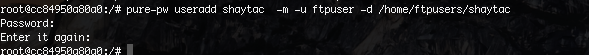
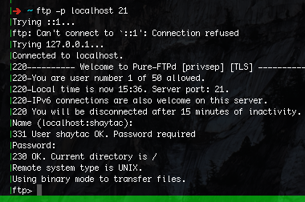

1. Create the serverless repo via `serverless create --template aws-nodejs --path fetch-ftp`  

2. Within the root directory run `docker-compose up` to bring up the ftp server. Keep this terminal session running.
]

3. Open a new shell session and issue `docker ps` to determine the container id of the ftp server. 

]
4. Copy the container id and run `docker exec -it <contianer-id> /bin/bash`. This will allow you to open a shell session inside the ftp docker container. 
]

5. Within the container issue the following command `pure-pw useradd shaytac -m -u ftpuser -d /home/ftpusers/shaytac` to create an ftp user, make sure to have the pass noted. This will create 2 folders in `./data` directory so next time you `docker-compose up` you will not need to create user again.

]

ps: this folder will be .gitignored 

6.  ` ftp -p localhost 21` to test your connection with the username/pass you just created.

7. To run the debugger `node --inspect --inspect-brk ./node_modules/.bin/serverless invoke local -f ftpfetch` and open google chrome and visit `chrome://inspect`

8. To upload to ftp `node ./node_modules/.bin/serverless invoke local -f ftpupload`

9. To download from ftp `node ./node_modules/.bin/serverless invoke local -f ftpdownload`
